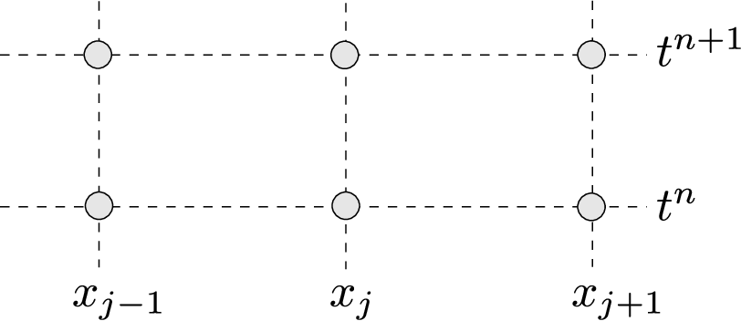
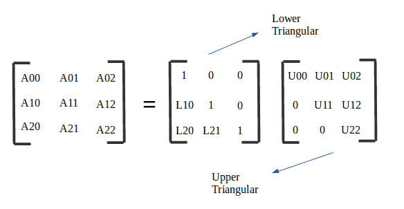

# Numerical-Crank-Nicholson
The Crank-Nicolson method is a powerful time-stepping technique often used in numerical analysis and computational modeling. It seamlessly blends the advantages of explicit and implicit methods, earning its designation as a semi-implicit approach. Known for its reliability and precision, this method is widely applied in solving partial differential equations.

  

### Key Characteristics of the Crank-Nicolson Method

- **Implicit Nature**:
    
    Requires solving a system of equations at each time step, which increases computational cost but provides unconditional stability for linear problems. It allows for larger time steps without numerical instability.
    
- **Second-Order Accuracy**:
    
    Provides second-order accuracy in both time and space, offering high precision. Suitable for simulations needing detailed and accurate results.
    
- **Symmetry and Averaging**:
    
    Combines explicit and implicit schemes by averaging them, ensuring consistency. Reduces numerical errors and enhances solution quality.
  
## Steps for solving using Crank-Nicholson for radial domain
**1- Discretize Domain:**

  First, divide the radial domain r ∈ [0,R] to N equally spaced points with spacing Δr. Similarly, divide the time domain into steps of size Δt.
  
  Label each point as  $u^n_i$ , where:

- $i$ is the spatial index.
- $n$ is the time index.
-----------------------------------------------------------------------------------------------------------------------------------------------------------------
**2  -  Set up the matrix equation:** 

Apply the **Crank-Nicolson scheme**, which is the average of the explicit and implicit methods. The discretized equation becomes a **linear system** of the form:

$$
A \cdot u^{n+1} = B \cdot u^n
$$

  Where:

- $u^n$ is the known solution at the current time step.
- $\mathbf{u}^{n+1}$ is the unknown solution for the next time step.
- $A$ and $B$ are matrices created using finite difference formulas that account for radial terms, for example a term like this: $\frac{1}{r^2} \frac{d}{dr} \left( r^2 \frac{du}{dr} \right)$
-----------------------------------------------------------------------------------------------------------------------------------------------------------------
**3 -  Solve the matrix system:** 

  Solve the system of equations $A \cdot u^{n+1} = B \cdot u^n$ using a numerical solver (like LU decomposition or sparse solvers).
  
  

  

-----------------------------------------------------------------------------------------------------------------------------------------------------------------
**4 -   Apply Boundary Conditions:** 

  For radial problems, special care is needed at the center r = 0.

  We use **L'Hopital’s rule**, which leads to a symmetric condition like:

$\left. \frac{\partial u}{\partial r} \right|_{r=0} = 0$

At the outer boundary r = R , you may apply:

- **Neumann BC**: no flux → $\frac{\partial u}{\partial r} = 0$
- **Dirichlet BC**: fixed value → $u = \text{constant}$

These conditions affect the first and last rows of your matrices.

-----------------------------------------------------------------------------------------------------------------------------------------------------------------
**5 -  Iterate over time time steps**

  Repeat Steps 2–4 for each time step until you reach the final simulation time. 

  At each iteration, update the solution vector $u$ to move forward in time.

